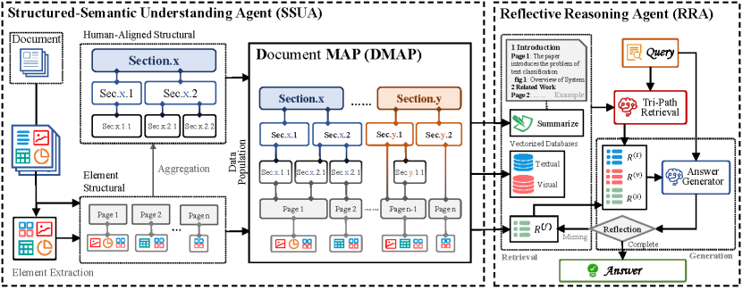

---
# 新闻标题
title: 喜报 | 热烈祝贺付顺亮硕士生论文被Web领域顶级会议WWW 2026录用！

# 发布日期
date: 2026-01-13

# 列表页显示的简短摘要（一句话概括）
summary: 实验室博士生付顺亮的研究成果被中国计算机学会（CCF）推荐的A类国际学术会议WWW 2026录用，特此祝贺！

# 封面图设置
# 确保你的文件夹里有 featured.png 这张图
image:
  caption: 'Image creates by AI'
  focal_point: "Smart"
  # 设置为 true，则只在列表页显示小图，点进来后不显示大横幅
  # 设置为 false，则点进来后标题上方会显示一张大横幅图
  preview_only: true 
---

第34届国际万维网大会（WWW 2026）论文录用结果今日揭晓，南京理工大学多媒体计算实验室有一篇论文被录用。WWW是互联网与数据挖掘领域的顶级国际会议（CCF A类会议）。WWW 2026将于2026年4月13日至17日在阿拉伯联合酋长国的迪拜节日城（Dubai Festival City）举办。本次会议接收的简要介绍如下：  
**DMAP: Human-Aligned Structural Document Map for Multimodal Document Understanding**  
**作者**：付顺亮，张彦昕，向一心，杜晓宇，唐金辉  
**单位**：南京理工大学  
**简介**：现有的多模态文档问答系统主要依赖于平面化的语义检索，即将文档表示为一组互不关联的文本块，通过语义向量进行检索。这种做法很大程度上忽略了文档自身固有的层次结构和各个元素之间的关系结构。这与人类理解文档的方式有着很大不同：人类通常会利用逻辑和空间依赖关系以辅助文档理解，如章节组织、图表-文本对应关系和交叉引用关系。为了解决这一局限性，本文引入了一种文档级结构化文档映射（DMAP），该映射明确编码了多模态文档中的层次组织和元素间关系。具体而言，本文设计了一个结构化语义理解智能体，通过将文本内容与图片、表格和图表组织在一起，构建一个与人类对齐的层次模式，该模式同时捕获语义和布局依赖关系，从而构建DMAP。基于这种文档的表示，一个反思推理智能体执行结构感知和证据驱动的推理，通过与DMAP进行有针对性的交互，动态评估检索到的上下文的充分性，并迭代优化答案。在多模态文档问答的基准测试上进行的大量实验表明，DMAP能够生成与人类解释模式相一致的文档结构化表示，与传统的基于检索增强生成（RAG）的方法相比，显著提高了检索精度、推理一致性和多模态理解能力。

