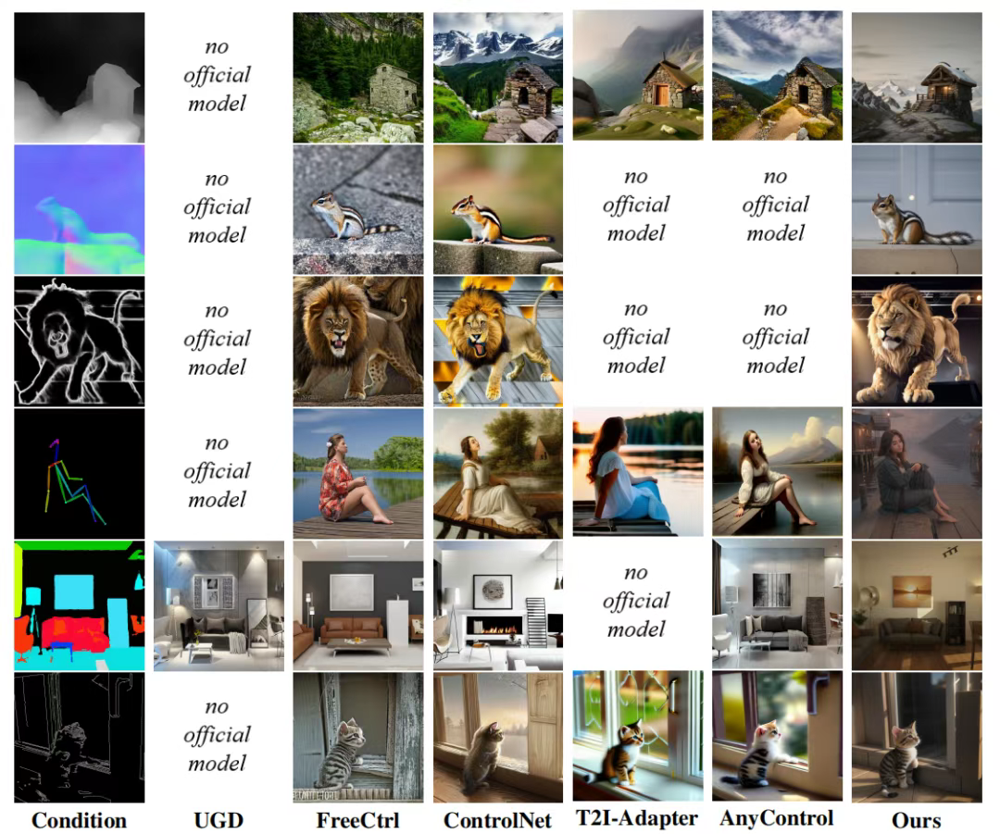
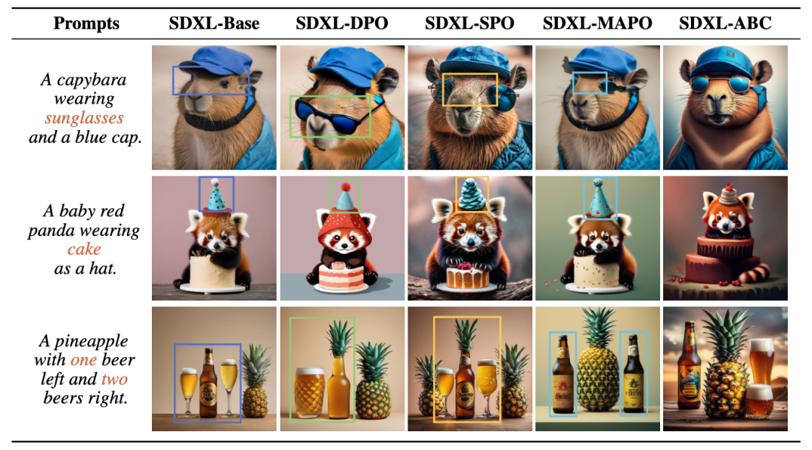
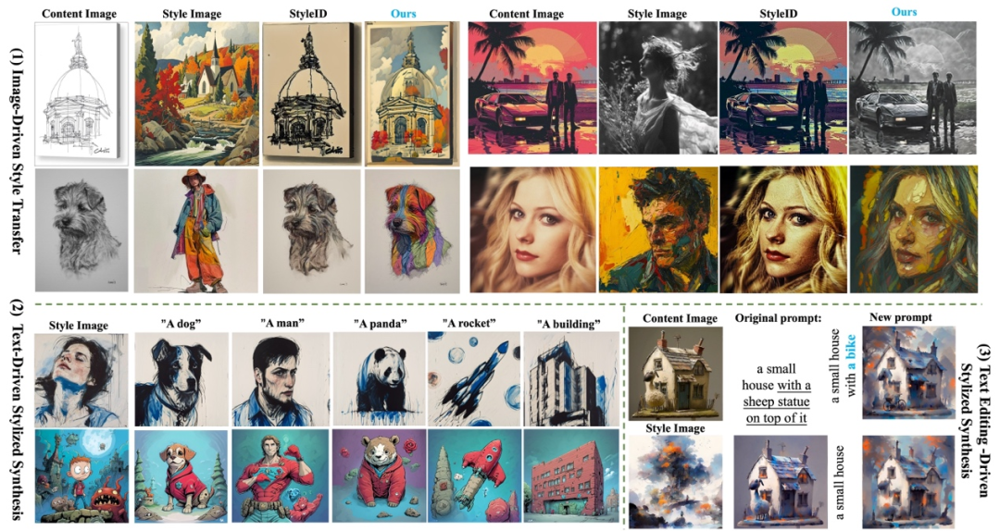
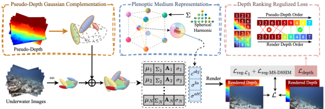
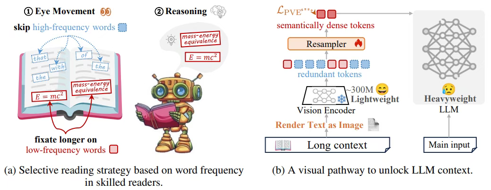
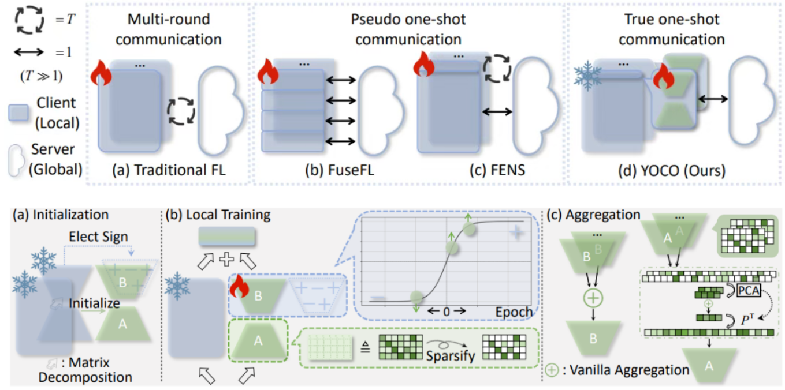
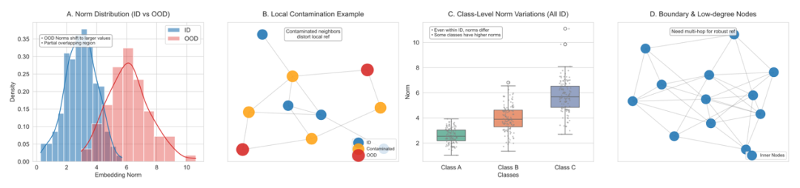
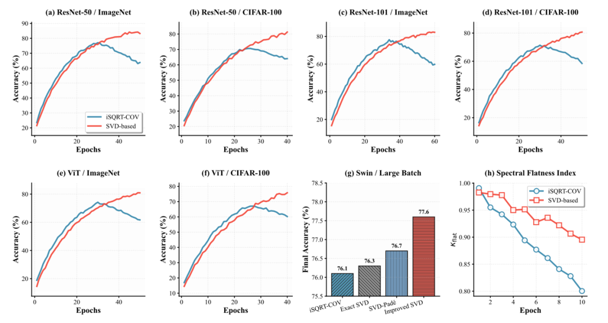
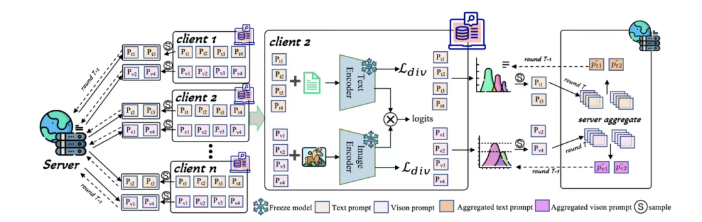
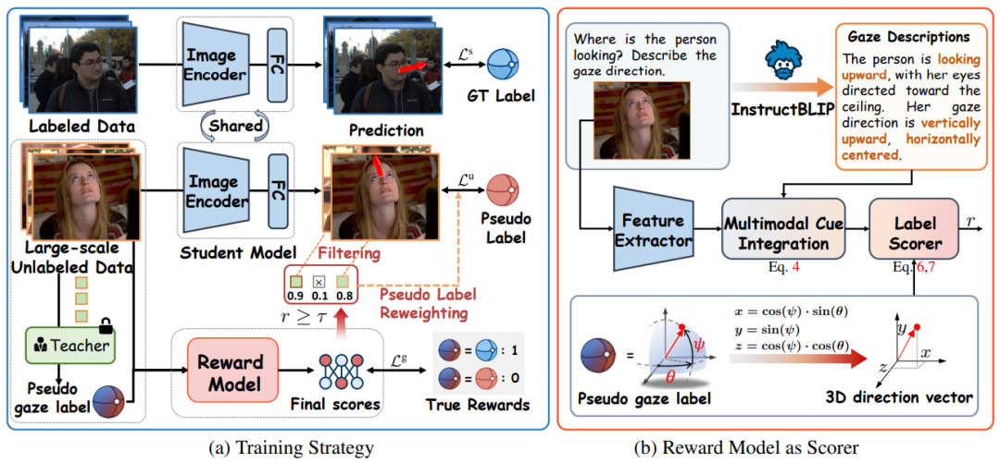

第39届神经信息处理系统大会（**NeurIPS 2025**）论文录用结果近日揭晓，南京理工大学多媒体计算实验室11篇论文被录用。NeurIPS是机器学习与人工智能领域的顶级国际会议（CCF A类会议）。NeurIPS 2025 主会场将于2025年12月2日—12月7日在圣地亚哥会议中心举办。本实验室录用论文简要介绍如下：（**按第一作者姓氏笔画排序**）

**1.DeblurDiff: Real-World Image Deblurring with Generative Diffusion Models**  
**作者**：孔令顺1, 张佳维2，邹冬青3，Fu Lee Wang4，任思捷4, 武小荷5, 董姜鑫1, 潘金山1  
**单位**：1南京理工大学，2商汤科技，3和平湾虚拟现实研究院，4香港都会大学，5哈尔滨工业大学  
**简介**：本文提出 DeblurDiff，一种面向真实场景图像去模糊的框架，通过将潜核预测网络（LKPN）与生成式扩散模型相结合，克服现有方法局限。现有方法往往直接将模糊图像作为条件输入扩散模型，导致生成过程难以产生清晰结构；而我们借助预训练 SD 模型先验，引入自适应机制估计像素级模糊核，并通过元素级自适应卷积（EAC）将其应用于局部内容，从而有效保留输入信息与结构完整性。大量实验表明，DeblurDiff 在合成与真实基准上均优于现有最佳方法，兼具结构保真与视觉质量。  

**2.DISCO: DISCrete nOise for Conditional Control in Text-to-Image Diffusion Models**  
**作者**：代龙泉1，吴铭1，薛德轿1，王赫1，唐金辉2  
**单位**：1南京理工大学，2南京林业大学  
**简介**：扩散模型应用中的一项主要挑战在于如何使生成结果与用户定义的条件对齐。现有的条件生成方法主要分为两大类：基于分类器的引导方法，需要可微的目标模型和基于梯度的修正；以及无分类器引导方法，直接将条件嵌入扩散模型中，但需要昂贵的联合训练和结构耦合。本文中，我们提出了第三种范式：DISCrete nOise（DISCO）引导，该方法将连续的条件修正项替换为从高斯先验中采样的有限离散噪声向量码本。条件生成被重新表述为码本选择任务，我们训练一个预测网络，根据中间扩散状态和条件输入选择最优的码向量。我们的方法无需可微性，且训练效率高，避免了先前方法中的梯度计算和结构冗余。实验结果表明，DISCO 在实现优异可控性的同时，显著降低了资源需求，使其成为条件扩散生成中一种可扩展且高效的新方案。 

**3.Aligning Text-to-Image Diffusion Models to Human Preference by Classification**  
**作者**：代龙泉1，魏小璐1，王赫1，王绍萌1，唐金辉2  
**单位**：1南京理工大学，2南京林业大学  
**简介**：文本到图像扩散模型通常依赖大规模网络数据进行训练，容易出现与人类偏好不一致的问题。我们提出 ABC（基于分类的对齐，Alignment by Classification） 框架，将偏好对齐重新表述为分类任务。与依赖次优 SFT 参考模型的 DPO 方法不同，ABC 假设存在理想参考模型，并将偏好数据视为半监督分类问题。我们设计了数据增强策略，将偏好比较转化为完全监督的训练信号，并提出 ABC 损失函数引导模型对齐。实验表明，ABC 在多种扩散模型上均优于现有方法，展现出高效、稳健且可扩展的偏好对齐能力。 

**4.CSGO: Content-Style Composition in Text-to-Image Generation**  
**作者**：邢鹏1，王浩帆2，孙彦鹏1，王奇勋2，白旭2,3, 艾昊4，黄任远5，李泽超1 
**单位**：1南京理工大学，2InstantX team，3小红书，4北京航空航天大学，5北京大学  
**简介**：图像风格迁移的发展从根本上受到了缺乏大规模、高质量且具有明确内容 - 风格 - 风格化监督的数据集的限制。现有方法主要采用无训练范式（例如图像反转），由于缺乏结构化的三元组数据，这些方法在可控性和泛化性方面受到限制。为了填补这一空白，我们设计了一个可扩展的自动化流程，用于构建和净化高保真的内容 - 风格 - 风格化图像三元组。借助该流程，我们推出了 IMAGStyle—— 首个此类大规模数据集，包含 21 万个用于风格迁移研究的多样化且精确对齐的三元组。在 IMAGStyle 的支持下，我们提出了 CSGO，这是一个统一的、端到端可训练的框架，通过独立的特征注入来解耦内容和风格表示。CSGO 在单一架构中联合支持图像驱动的风格迁移、文本驱动的风格化生成以及文本编辑驱动的风格化合成。大量实验表明，CSGO 实现了最先进的可控性和保真度，这证明了结构化合成数据在实现稳健且可泛化的风格迁移方面的关键作用。 

**Paper**：https://arxiv.org/html/2408.16766v1  
**Code**：https://github.com/instantX-research/CSGO

**5.Plenodium: UnderWater 3D Scene Reconstruction with Plenoptic Medium Representation**  
**作者**：吴昌广1，董姜鑫1，李成建1，唐金辉2 
**单位**：1南京理工大学，2南京林业大学  
**简介**：我们提出了一种名为 Plenodium（plenoptic medium）的高效三维场景表示框架，能够同时建模物体与参与介质。与现有仅依赖于视角建模的介质表示方法不同，我们的全光介质表示结合了基于球谐函数的方向与位置编码，从而实现了高精度的水下场景重建。为了解决退化水下环境中的初始化挑战，我们提出了 伪深度高斯补全 方法，用于为 COLMAP 得到的点云引入稳健的深度先验。此外，我们设计了一种 深度排序正则化损失，以优化场景几何并提升深度图的序关系一致性。大量真实水下数据集上的实验表明，我们的方法在三维重建任务上取得了显著提升。进一步地，我们还构建了一个带有真实标注和可控散射介质的模拟数据集，用于验证该方法在水下场景中的恢复能力。

**Code**：https://plenodium.github.io

**6.Vision-centric Token Compression in Large Language Model**  
**作者**：幸羚1，王金鹏2，严锐1，舒祥波1，唐金辉3 
**单位**：1南京理工大学，2中南大学，3南京林业大学  
**简介**：在真实应用中，大语言模型的上下文窗口正被扩展到数十万级别的token，同时模型参数规模也从数十亿级迅速增长到万亿级。这种双重扩张导致计算量和显存成本急剧飙升，使得token压缩成为不可或缺的技术。为此，我们提出一种模仿人类阅读方式的 慢–快token压缩框架：在快速通道中，远距离的上下文被转化为图像，并由一个冻结的轻量级视觉编码器进行快速浏览，以高效提取低显著性信息；在慢速通道中，近距离的上下文则直接输入LLM以进行细粒度推理。此外，我们设计了概率引导的视觉增强目标，在训练阶段对高频token进行掩码，引导Resampler专注于语义丰富的区域——就像熟练的读者会自然忽略功能词一样。在11个上下文学习基准测试中，我们的方法在使用2.3倍更少的token的情况下实现了与原始输入相同的精度，同时计算量降低16%，显存占用减少50%。该方法在 TriviaQA、NQ、PopQA、NLUI 和 CLIN 等任务中，相比当前最强的基于文本编码的压缩方法平均提升7.6%，为大语言模型的 token 高效利用树立了新的标杆。

**Paper**：https://arxiv.org/pdf/2502.00791

**7.You Only Communicate Once: One-shot Federated Low-Rank Adaptation of MLLM**  
**作者**：徐斌倩1，梅海洋2，白泽琛2，贡金金1，严锐1，谢国森1，姚亚洲1，Basura Fernando3，舒祥波1 
**单位**：1南京理工大学，2新加坡国立大学，3A*STAR  
**简介**：多模态大语言模型（MLLMs）结合联邦学习（FL）能够快速适应隐私敏感任务，但其对多轮通信的依赖往往带来高通信开销和较大攻击风险。为缓解这一问题，单次联邦学习（OFL）被提出，旨在通过一次客户端与服务器的交互完成适应。然而，现有自适应集成式 OFL 方法仍需进行超过一轮通信，因为纠正异质性引发的本地偏差依赖于聚合后的全局监督，因此始终无法实现真正的单次通信。本文首次在 OFL 场景下实现了 MLLMs 的真正单次通信，探讨是否仅依赖隐式（即初始而非聚合）全局监督即可有效缓解本地训练偏差。实证结果表明，在本地训练中引入方向性监督能够显著降低客户端冲突与本地偏差。基于这一发现，我们提出 YOCO：通过对 LoRA B 进行符号正则化来施加方向性监督，以确保全局一致性；同时对 LoRA A 进行稀疏正则化以保留客户端的个性化适应能力。实验结果显示，YOCO 将通信量降低至多轮 FL 的约 0.03%，在多个多模态场景中不仅优于现有多轮方法，还在所有单次通信方法中持续保持领先表现。

**Code**：https://github.com/1xbq1/FedMLLM

**8.Refining Norms: A Post-hoc Framework for OOD Detection in Graph Neural Networks**  
**作者**：顾嘉伟1，乔子越2,3，李泽超1 
**单位**：1南京理工大学，2大湾区大学，3东莞智能与信息技术重点实验室  
**简介**：随着图神经网络在各类关键任务中的应用日益广泛，如何确保其在面对未知或异常输入时的安全性和可靠性已成为一项紧迫挑战，模型在处理训练分布之外的数据时常常会给出过度自信的错误预测。针对这一难题，我们提出了一种名为RAGNOR的创新性事后框架，旨在显著提升图神经网络的分布外检测能力。该框架深入剖析了现有技术在图域应用时面临的核心困境，即邻居节点的异常污染、不同类别间嵌入范数的天然差异以及边界与低度节点的上下文信息不足。RAGNOR巧妙地融合了全局Z分数归一化、基于中位数的鲁棒局部聚合以及多跳邻域信息融合三大模块，从而在无需重新训练模型或改动其原有结构的前提下，高效地将原始嵌入范数信号提炼为稳健的分布外识别分数。大量的基准测试实验证明，RAGNOR不仅在性能上达到甚至超越了现有先进技术，更以其轻量化、模块化的直观设计，为研究者和工程师提供了一个可以轻松集成到现有图计算流程中的即插即用型解决方案，有力推动了图神经网络在实际应用中的稳健部署。

**Paper**：https://neurips.cc/virtual/2025/poster/116328

**9.Revitalizing SVD for Global Covariance Pooling: Halley’s Method to Overcome Over-Flattening**  
**作者**：顾嘉伟1，乔子越2,3，李昕鸣4，李泽超1 
**单位**：1南京理工大学，2大湾区大学，3东莞智能与信息技术重点实验室，4北京建筑大学  
**简介**：在现代视觉识别领域，全局协方差池化技术因其能捕捉丰富的二阶统计信息而备受关注，但现有主流方法却面临着两难困境，即基于牛顿迭代的iSQRT-COV方法虽然在训练初期表现稳定，却会在后期因过度压缩关键特征导致精度饱和，而基于SVD的精确方法虽能保留重要信息，却极易在训练早期因梯度问题而崩溃。为了解决这一长期存在的矛盾，我们提出了一种名为Halley-SVD的全新高阶迭代方案。该方法从根本上革新了SVD在全局协方差池化中的应用，它巧妙地借鉴了哈雷迭代法的思想，既避免了传统SVD方法中因特征值相近而导致的梯度爆炸问题，又克服了iSQRT-COV方法后期训练中出现的“过度扁平化”现象。Halley-SVD无需任何人工阈值调整或复杂的混合训练策略，就能在整个训练过程中同时保证梯度的平滑性和对高维特征谱的保真度。在多个大型卷积网络和视觉Transformer模型上的广泛实验表明，尤其是在大规模模型与大批量训练的设定下，Halley-SVD能够持续稳定地超越iSQRT-COV，实现更高的最终识别精度，为充分释放深度网络中二阶统计信息的潜力开辟了一条兼具鲁棒性与精确性的新路径。

**Paper**：https://neurips.cc/virtual/2025/poster/116798

**10.FedMGP: Personalized Federated Learning with Multi-Group Text-Visual Prompts**  
**作者**：薄维昊1，孙彦鹏2，汪瑜3，张欣彧4，李泽超1 
**单位**：1南京理工大学，2新加坡国立大学，3百度，4奥克兰大学  
**简介**：本文提出了一种新颖的个性化联邦学习方法——FedMGP（Multi-Group Text-Visual Prompts），通过多组文本-视觉提示实现对异构数据分布下视觉-语言模型的高效个性化适应。FedMGP在每个客户端维护多组成对的文本和视觉提示，并引入多样性损失促进各组提示在不同语义层面上的专精。通信时，采用动态聚合机制，优先整合与全局提示语义一致的本地提示组，同时保留对少见模式的探索，从而在保持共性知识的同时强化个性化特征。FedMGP在参数量极低（通信参数仅5.1k）的情况下，在多项联邦视觉-语言基准上实现了个性化与泛化能力的双重提升，显著优于现有方法。

**Code**：https://github.com/weihao-bo/FedMGP.git

**11.OmniGaze: Reward-inspired Generalizable Gaze Estimation In The Wild**  
**作者**：瞿宏谕1，魏建安2，舒祥波1，姚亚洲1，王文冠2，唐金辉3 
**单位**：1南京理工大学，2浙江大学，3南京林业大学  
**简介**：当前的三维视线估计方法在跨越不同数据域时表现出有限的泛化能力，主要原因在于标注数据集的稀缺以及标注数据多样性的不足。 在本工作中，我们提出了一个用于三维视线估计的半监督框架，利用从多样化且不受约束的真实环境中收集的大规模无标注数据，以减轻领域偏差并提升野外场景中的视线估计泛化能力。首先，我们构建了一个涵盖多样化无标注人脸图像的数据集，这些图像在面部外观、背景环境、光照条件、头部姿态以及眼部遮挡方面均具有显著差异。 为了充分利用分布更广的无标注数据，我们采用标准的伪标签策略，并设计了一种奖励模型来评估伪标签的可靠性。除了以三维方向向量形式生成的伪标签外，该奖励模型还引入了由现成视觉编码器提取的视觉嵌入，以及通过提示多模态大语言模型生成的注视视角语义信息，用以计算置信度分数。随后，这些置信度分数被用于筛选高质量的伪标签，并在损失计算中对其进行加权。大量实验表明我们的方法在五个数据集的域内和跨域设置下均实现了最新的性能水平。
