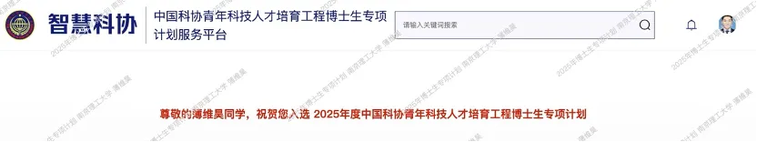
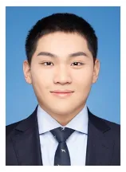

近日，从中国科协获悉，南京理工大学智能媒体分析实验室博士生薄维昊（导师：李泽超教授），经中国人工智能学会托举，成功入选2025年度中国科协青年科技人才培育工程博士生专项计划。

<h2 style="text-align: center; color: #5e72e4; margin-top: 30px; margin-bottom: 20px;">背景信息</h2>

中国科协青年科技人才培育工程博士生专项计划是中国科协整合政府和社会资源，面向广大青年科技人员实施的能力提升项目，旨在帮助入选对象深入体察中国国情、扩大专业视野、了解社会需求。支持对象为具有中国国籍的全日制在读博士研究生。

<h2 style="text-align: center; color: #5e72e4; margin-top: 30px; margin-bottom: 10px;">个人简介</h2>

  

 

薄维昊，中共党员，南京理工大学计算机科学与工程学院 2023 级直博生，师从李泽超教授。目前于百度大模型前沿探索部担任研究实习生，由百度首席科学家、加拿大外籍院士王井东直接指导。主要研究方向为多模态大模型（MLLM）及其应用。在学术研究方面，已在 NeurIPS、IEEE TGRS 等国际顶级会议与期刊上发表论文 5 篇；并长期担任 CVPR、ICLR、AAAI、IEEE TGRS 等顶级学术会议与期刊的审稿人。曾获国家奖学金、中国大学生计算机设计大赛全国一等奖（人工智能实践赛道）等多项荣誉。