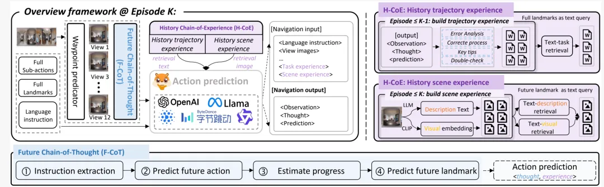
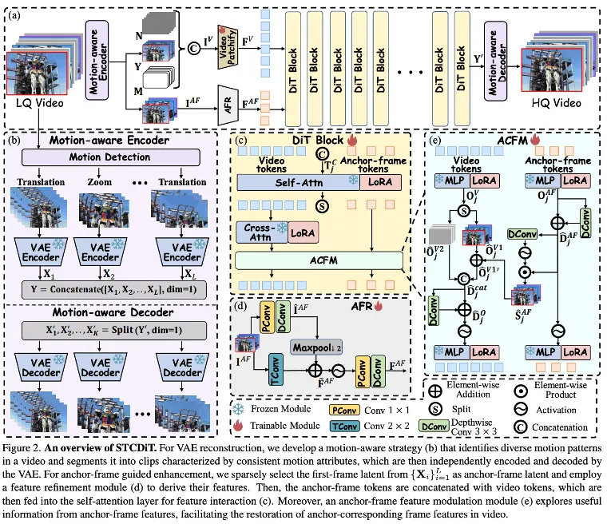
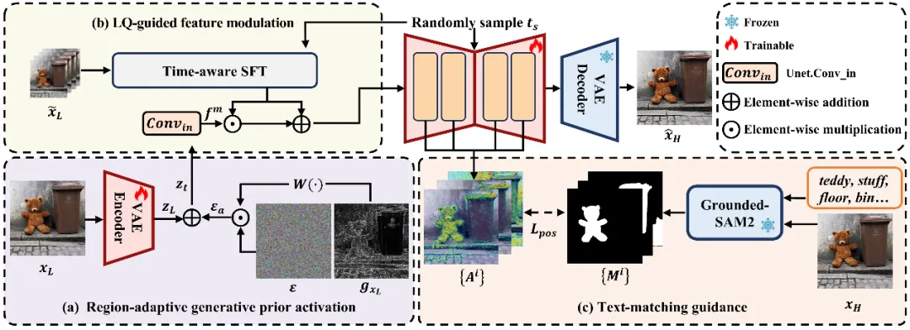
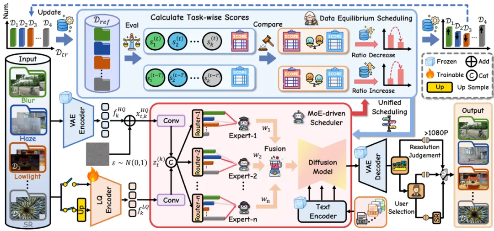
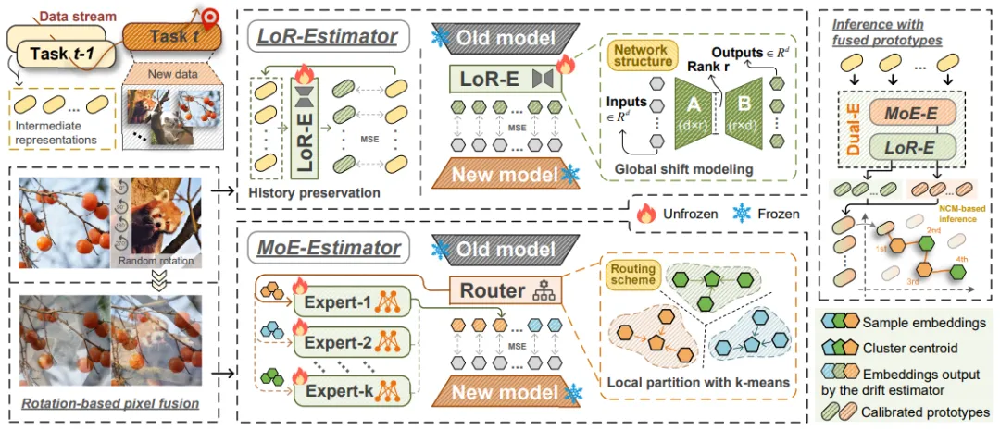
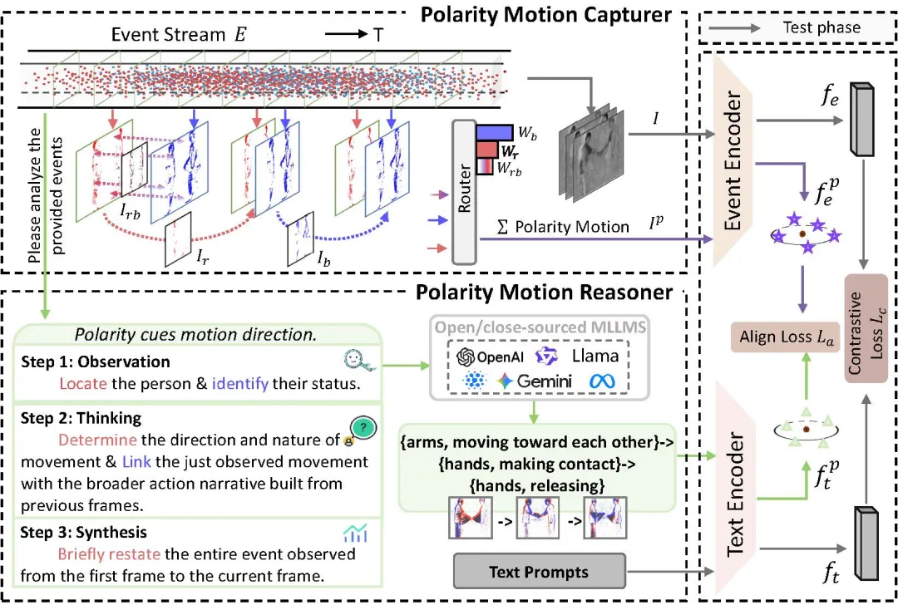
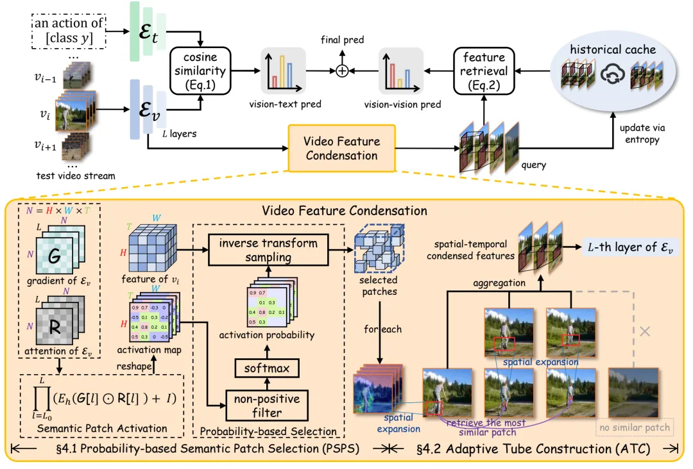
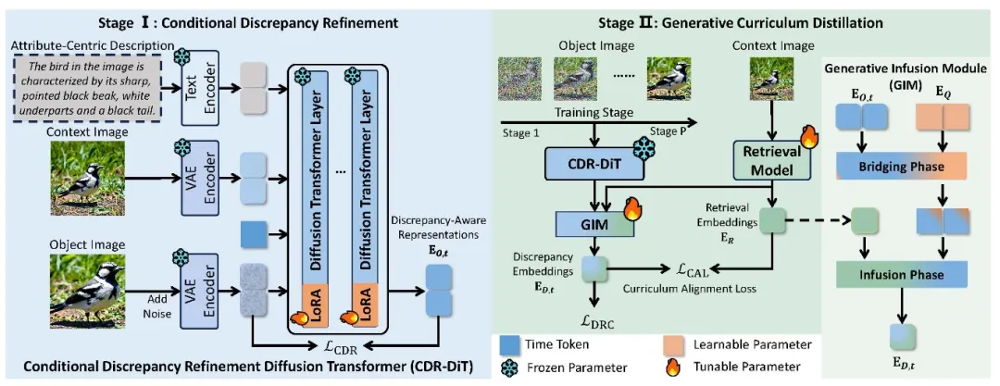
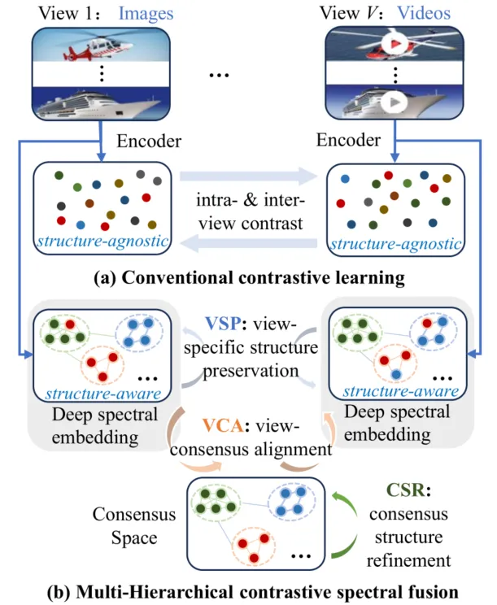
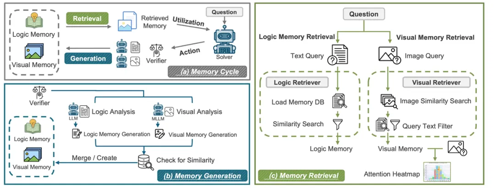

第43届IEEE/CVF计算机视觉与模式识别会议（**CVPR 2026**）论文录用结果近日揭晓，**南京理工大学智能媒体分析实验室10篇论文被录用**。CVPR是计算机视觉与模式识别领域的顶级国际会议（CCF A类会议），本届会议共收到16,092篇有效投稿，录用4,090篇，录用率为25.42%。CVPR 2026主会场将于2026年6月3日—6月7日在美国科罗拉多州丹佛会议中心举办。本实验室录用论文简要介绍如下：（**按第一作者姓氏笔画排序**）

**1.History to Future: Evolving Agent with Experience and Thought for Zero-shot Vision-and-Language Navigation**  
**作者**：代广昭1，王硕2，王子涵3，谢国森1，杨杨1，潘金山1，孙倩茹4，舒祥波1  
**单位**：1南京理工大学，2中国人民大学，3新加坡国立大学，4新加坡管理大学  
**简介**：连续环境下的视觉-语言导航（VLN-CE）要求智能体能够理解自然语言指令，并在复杂环境中自主导航至目标地点。随着大语言模型（LLMs）的飞速发展，近期研究开始尝试将其应用于“零样本 VLN-CE”，旨在解决传统基于训练的范式在泛化能力上的短板，并展现出了巨大的潜力。然而，目前基于LLM 的方案主要依赖于简单的推理进行决策，普遍缺乏有效的反馈机制——例如对历史错误的追溯以及对未来潜力的预判。这导致智能体一旦在任务初期陷入误区，往往会接连失败。在本文中，我们对基于 LLM 的零样本 VLN-CE 进行了重新思考，并提出了一种名为 EvoNav 的全新范式。EvoNav 通过 “未来思维链”（Future Chain-of-Thought, F-CoT） 和 “历史经验链”（History Chain-of-Experience, H-CoE），赋予了智能体预判未来与总结过去的能力。其中，F-CoT（未来思维链）通过预测后续动作和地标作为“思维引导”，辅助智能体进行导航进度评估与方向选择；H-CoE（历史经验链）将历史轨迹与场景凝练为“经验储备”，从而提升导航决策的可靠性。通过 F-CoT 与 H-CoE 的协同演进，智能体的决策能力得到了显著增强。在仿真环境与真实世界场景中的大量实验证明，EvoNav 能够显著提升导航性能。  

**2.STCDiT: Spatio-Temporally Consistent Diffusion Transformer for High-Quality Video Super-Resolution**  
**作者**：陈俊阳1，董姜鑫1，孙龙1，杨艺新 1，潘金山1  
**单位**：1南京理工大学  
**简介**：近年来，基于预训练 Diffusion Transformer（DiT）的视频超分辨率方法已成为提升视频复原质量的重要方向。然而，其在真实场景中仍面临两大挑战：重建过程难以维持时序稳定性，以及生成阶段难以恢复结构保真的细节。针对上述问题，本文提出 STCDiT 视频超分框架，用于从低质量视频中恢复结构保真且时序连贯的高分辨率结果。在重建阶段，我们发现 Causal VAE 的时序压缩算子仅能聚合局部空间信息，难以在复杂空间变换场景下准确建模跨帧空间对应关系，从而引入重建误差。为此，我们提出一种 Motion-aware VAE 重建策略，将输入视频按运动一致性划分为多个片段，并对各片段独立进行 VAE 编码与重建，从而显著提升复杂运动场景下的时序稳定性。在生成阶段，我们进一步观察到分段编码后，各片段的首帧潜变量未经过时序压缩，相比其他帧保留了更丰富的空间结构信息。基于这一特性，我们提出 Anchor-frame guided 机制，将各片段首帧潜变量作为结构锚点，引导扩散生成过程，从而增强视频整体的结构保真度。大量实验结果表明，与现有最先进方法相比，STCDiT 在结构保真性与时序连贯性方面均取得显著优势。 

**3.Bridging Fidelity-Reality with Controllable One-Step Diffusion for Image Super-Resolution**  
**作者**：陈浩1，陈俊阳1，潘金山1，董姜鑫1  
**单位**：1南京理工大学  
**简介**：近年来，基于扩散的单步式方法在图像超分辨率领域取得了显著进展，但仍面临三大挑战：(1) 低质量输入LQ经压缩编码导致信息丢失，致使次优保真性能；(2) 生成式先验缺乏区域判别式激活，常导致平滑区域出现伪影，而纹理区域细节不足；(3) 文本交互错位，即扩散模型中文本嵌入的交互区域与其对应的语义区域在空间上未能对齐。针对以上问题，我们提出可控单步扩散网络CODSR用于图像超分辨率。首先，我们提出LQ引导的特征调制模块，其利用LQ输入的原始未压缩信息为扩散过程提供高保真度条件。其次，我们提出基于梯度的噪声加权策略以实现区域自适应的生成式先验激活，在提升感知丰富度的同时保持局部结构保真度。最后我们提出一种文本匹配引导策略，其在训练阶段利用Grounded-SAM2生成文本交互区域图，进而引导并实现在扩散过程中文本与图像交互的空间对齐。大量实验表明，相较于现有最先进方法，CODSR在高效一步推理下实现了更优的感知质量和具有竞争力的保真度。 

**4.FoundIR-v2: Optimizing Pre-Training Data Mixtures for Image Restoration Foundation Model**  
**作者**：陈翔1，潘金山1，董姜鑫1，杨健1，唐金辉2  
**单位**：1南京理工大学，2南京林业大学  
**简介**：近年来，随着预训练数据规模与质量的不断提升，图像复原基础模型取得了显著进展。在本工作中，我们发现，不同复原任务之间的数据混合比例同样是一个关键因素，直接决定了all-in-one图像复原模型的整体性能。为此，我们提出了一种高容量的基于扩散模型的图像复原基础模型FoundIR-v2，该模型采用数据均衡调度范式，对来自不同任务的混合训练数据比例进行动态优化。通过引入数据混合定律，我们的方法能够保证数据集组成的整体平衡，从而使模型在多样化任务中实现稳定的泛化能力与全面的性能表现。此外，我们在生成式预训练过程中引入了一种有效的混合专家驱动调度器，用于为各类复原任务灵活分配任务自适应的扩散先验，以应对不同任务在退化形式与退化程度上的差异。大量实验表明，我们的方法能够覆盖超过50个子任务，适用于更广泛的真实场景，并在与当前最先进方法的对比中取得了具有竞争力的性能。 

**5.Dual-Estimator: Decoupling Global and Local Semantic Shift for Drift Compensation in Class-Incremental Learning**  
**作者**：徐凡康1，金露1，孙彦鹏2，轩诗宇1，李泽超1  
**单位**：1南京理工大学，2新加坡科技设计大学  
**简介**：持续学习（Continual Learning, CL）为模型获取新知识提供了一种有效范式，而“不保留历史样本”的学习原则进一步催生了更符合真实应用场景的无样本持续学习（exemplar-free CL）。然而，该范式面临的核心挑战在于语义漂移（Semantic Shift），即需要对历史类别的表征进行可靠激活，使其与当前任务的特征空间保持一致。现有方法通常通过漂移补偿（Drift Compensation）充当这一激活机制，但普遍假设语义分布与漂移在全局范围内均匀一致，这在随机数据流场景下显然并不现实。针对上述问题，本文提出了一种双估计器框架（Dual-Estimator, Dual-E），用于解耦全局与局部语义漂移，从而系统性地应对语义非均匀性问题。具体而言，针对任务内 (Intra-task) 语义分布非均匀性，即低频语义难以获得充分补偿的问题，Dual-E引入了一种由多个网络构成的混合专家估计器（MoE-E），以在多样化的局部表征空间中捕捉不同层次的语义漂移模式。针对任务间 (Inter-task)语义漂移非均匀性，即不同类别的语义变化幅度存在显著差异、统一尺度补偿难以有效覆盖的问题，Dual-E 进一步设计了一种低秩估计器（LoR-E），通过低秩网络建模相邻任务表征空间的全局语义变化趋势。此外，Dual-E 采用解析解形式的高效更新策略，仅需少量训练轮次即可完成参数更新，从而能够以插件方式高效集成至现有无样本持续学习框架中。在多个基准数据集上的大量实验结果表明，Dual-E 在性能上显著优于当前主流方法。

**6.Seeing Motion Through Polarity for Event-based Action Recognition**  
**作者**：曹美琦1，张嘉超2，蒋鑫1，严锐1，姚亚洲1，李泽超1，舒祥波1  
**单位**：1南京理工大学，2南京工程学院  
**简介**：基于事件的动作识别 (EAR) 为理解复杂条件下的动态行为提供了一条很有前景的途径。视觉语言模型的最新进展将跨模态学习范式引入 EAR，使模型能够将事件流与文本语义关联起来，从而增强概念理解。然而，现有方法通常忽略了事件数据中固有的极性驱动运动线索，导致时空表征并非最优。为了解决这一局限性，我们提出了一种极性知识增强框架 (POKER)，该框架显式地整合了跨视觉和文本模态的事件极性感知运动知识。POKER 由两个协同组件构成：极性运动捕捉器 (PMC) 和极性运动推理器 (PMR)。具体而言，PMC 将正负极性解耦以捕捉极性敏感的运动线索，而 PMR 则通过大型语言模型对极性引起的运动动态进行语义分析。 通过极性对齐，POKER 将语义推理与视觉动态相结合，从而实现更具区分性的表征。在多个基准测试上的大量实验表明，POKER 能够提升各种事件表征的性能。

**7.Condensed Test-Time Adaptation of VLMs for Action Recognition**  
**作者**：葛文轩1，瞿宏谕1，严锐1，谢国森1，姚亚洲1，舒祥波1，唐金辉2  
**单位**：1南京理工大学，2南京林业大学  
**简介**：测试时适配（Test-Time Adaptation, TTA）为视觉-语言模型在零样本动作识别中的泛化提供了新的解决思路。近年来，随着大规模视觉-语言模型的快速发展，基于记忆的无需训练的动态适配方法（Training-free Dynamic Adapter, TDA）被提出用于缓解分布偏移问题。然而，现有方法通常依赖“视觉-文本对齐”与“视觉-视觉对齐”的两阶段映射链进行推理，由于两种对齐机制在语义驱动程度上的不对称性，映射链往往呈现非传递性：缓存样本与文本标签之间是语义驱动的对齐，而测试样本与缓存样本之间则更多受外观因素主导。这种不一致性容易引入语义无关干扰（如背景相似性），从而限制零样本动作识别的泛化能力。在本文中，我们重新审视了基于记忆的无需训练测试时适配范式，并提出了一种名为 CONDA（Condensed Dynamic Adapter）的全新框架。CONDA 的核心思想在于对视频特征进行语义凝练，以视觉-文本对齐信号引导视觉-视觉对齐，从而恢复映射链的传递性与一致性。在多个标准基准与复杂场景上的大量实验结果表明，CONDA 在保持较低计算开销的同时，显著提升了零样本动作识别性能，并展现出良好的泛化能力与可解释性。

**8.DiT-Distill: Open-Set Fine-Grained Retrieval via Generative Curriculum Knowledge**  
**作者**：蒋鑫1，唐昊2，曹美琦1，高俊尧3，沈飞4，李泽超1  
**单位**：1南京理工大学，2香港理工大学 3同济大学 4新加坡国立大学  
**简介**：开放集细粒度检索是一项极具挑战性的任务，模型必须能够泛化到未见过的子类别。现有方法通常难以做到这一点，因为它们会从封闭集的训练标签中嵌入特定类别的语义。最近，扩散变换器 (DiT) 通过编码与标签无关的以属性为中心的生成式课程知识，展现出了良好的前景。然而，原始的 DiT 并未针对细粒度的视觉差异进行优化，并且其庞大的规模使得部署变得不可行。为了解决这个问题，我们提出了 DiT-Distill，一个首先提炼然后提炼这些知识的框架。我们引入了一种“条件差异精炼”策略来微调 DiT，使其专注于感知差异的、以属性为中心的细节，而非整体上下文。随后，一种“生成式课程提炼”机制利用生成式融合模块和课程对齐损失，将 DiT 多个扩散时间步中精炼的层级知识迁移到一个轻量级主干模型中。这一过程最终生成了一个高效的检索模型，实现了“无 DiT 推理”。大量实验表明，DiT-Distill 在开放集细粒度数据集上取得了最先进的性能。

**9.Multi-Hierarchical Contrastive Spectral Fusion for Multi-View Clustering**  
**作者**：蔡兵1，王晓莉2，卢桂馥3，李泽超1  
**单位**：1南京理工大学，2南京林业大学，3安徽工程大学  
**简介**：多视图对比聚类已成为从异构数据源中学习全面表示的一种有效范式。然而，现有方法通常忽略了数据内在的几何结构与聚类结构，导致其对结构信息不敏感。本文提出一种新颖的多层级对比谱融合（MCSF）框架来解决上述问题。MCSF 将深度谱嵌入集成到编码器中，以保留局部流形结构，引导学习到的表示更适合聚类任务。为增强跨视图一致性，MCSF 引入多层级对比损失，联合优化以下三个目标：1）单视图结构保持；2）视图间共识对齐；3）共识结构精细化。该机制能够构建准确且语义一致的共识表示，有效融合多视图信息并揭示真实的聚类结构。在多个基准数据集的大量实验，证明了MCSF在聚类性能与表示质量上的有效性。

**10.Agentic Learner with Grow-and-Refine Multimodal Semantic Memory**  
**作者**：薄维昊1，2，张珊3，孙彦鹏4，伍晶晶2，谢群义2，谭啸2，陈坤斌2，和为2，李晓帆2，赵娜4，王井东2，李泽超1  
**单位**：1南京理工大学，2百度， 3澳大利亚机器学习研究所， 4新加坡科技设计大学  
**简介**：本篇论文提出了 ViLoMem，这是一种双流记忆框架，用于构建紧凑的、多模态语义的记忆。它分别对视觉干扰错误和逻辑推理错误进行编码，使多模态大语言模型能够从成功和失败的经验中学习。遵循增长与优化原则，该系统逐步积累和更新多模态语义知识并保留稳定、可推广的策略，同时避免灾难性遗忘。在九个多模态基准测试中，ViLoMem 持续提高了 pass@1准确率，并显著减少了重复的视觉和逻辑错误。消融实验证实了具有逻辑错误-视觉干扰分离的双流记忆的必要性，展示了面向终身学习和跨领域智能体学习的错误感知多模态记忆的价值。本技术面向百度视频理解、视频问答等业务场景提供解决方案，以更低的计算与存储成本，实现了更强的长时记忆建模能力。

